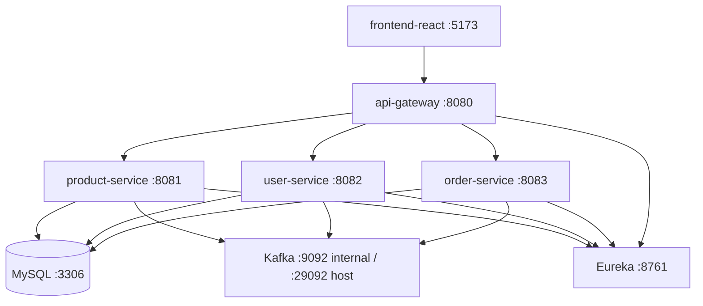

# 02 - Architecture
## System Topology
- Frontend app sends requests to `api-gateway` (`:8080`)
- Gateway routes requests to microservices via Eureka service discovery
- Services share MySQL for persistence
- Kafka is used for asynchronous events and stock/order related messaging
## Service Map

## Gateway Routing Rules
Defined in `backend/api-gateway/src/main/resources/application.yml`:
- `/api/products/**` -> `PRODUCT-SERVICE`
- `/api/users/**`, `/api/auth/**`, `/api/admin/**` -> `USER-SERVICE`
- `/api/orders/**` -> `ORDER-SERVICE`
## Health Checks
All backend services expose:
- `/api/health`
Used by Docker health checks in `backend/docker-compose.yml`.
